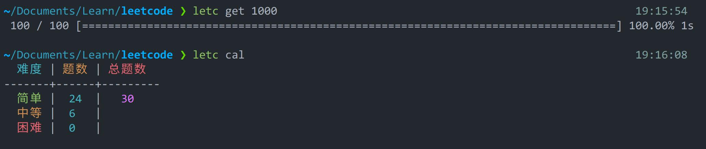

# letc


[简体中文](README.md)

## Introduction

A command line tool that includes a crawler function to help with the Liku brush



## Download

```go
go install github.com/levinion/letc@latest
```

## Get started

Run `letc init` to get the configuration file and start using it.

| commands | functions |
| -------------------- | ------------------------------------------------------------ |
| `letc cal` or `letc` | count the number of completed questions, you can create a new file named `todo` in the folder to ignore the undone questions |
| `letc get {question number}` | pull questions with a given question number |


## Configurable options

> Although modularity is not enabled by default here, it is recommended to use

```toml
codeDir="."         # The home directory where the topic code is stored, default is the working directory
moduled=false # whether to enable modularity, if true, the questions will be classified as easy, medium and hard
codeType="go" # Use the code suffix to distinguish the language type

[function]
useNeed=true # Whether to pull requirements along with the topic, rendered as a MarkDown file

[append]
# This string will be inserted before the code of the pulled topic
prefix="""\         
package main

func main(){

}

"""

[style]
tableMod=false # Whether to display the number of completed questions in table mode, make sure modularity is enabled before enabling it

[alias] # This provides a custom directory alias option
easy="easy"
medium="medium"
hard="hard"
```
